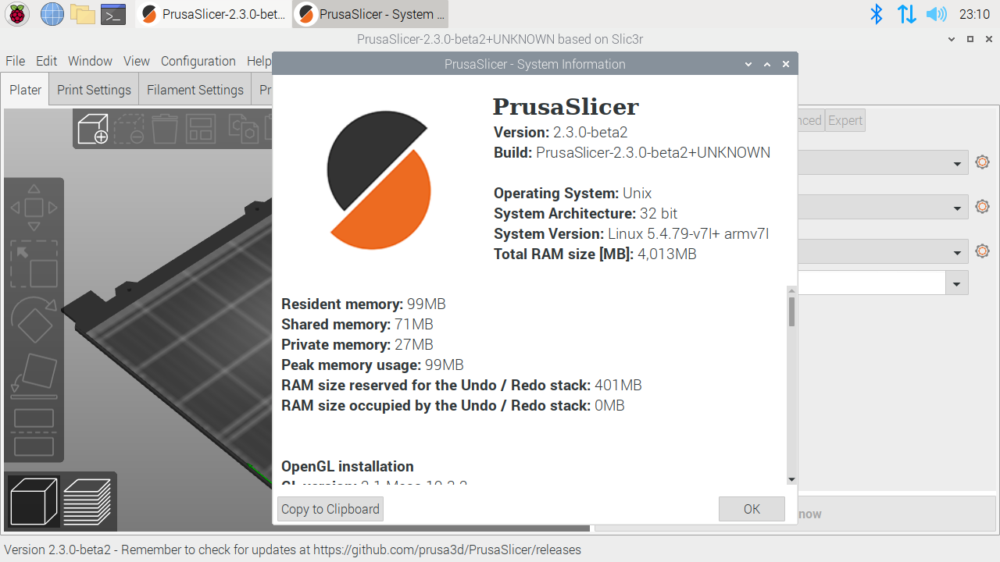

# PrusaSlicer-ARM.AppImage

PrusaSlicer packaged in an ARM AppImage for the Raspberry Pi 4. Build utilities and [releases](https://github.com/davidk/PrusaSlicer-ARM.AppImage/releases).

**To get a pre-built AppImage**, see [Releases](https://github.com/davidk/PrusaSlicer-ARM.AppImage/releases).

# About the AppImage format

An AppImage bundles built software into a single executable file, making its use as simple as downloading and running. This particular AppImage does
not fulfill the entire intent of the format (dependencies need to be installed on the host), but it allows for PrusaSlicer to be more easily 
used, removed and upgraded by an end user.

# Building your own AppImage

Requirement: Raspberry Pi 4 (or better).

If for any reason you would like to build your own ARM AppImage, all the files needed for doing so are in this repository. Clone or download this repository and run `./build.sh` in the root of the repository. 

This will install dependencies for building, compile PrusaSlicer, and drop a AppImage into `PrusaSlicer-ARM.AppImage/pkg2appimage/out`.

Copy the AppImage into a good location and run it.

# Needs to be implemented (contributions welcome)

- [ ] More dependency bundling with pkg2appimage
